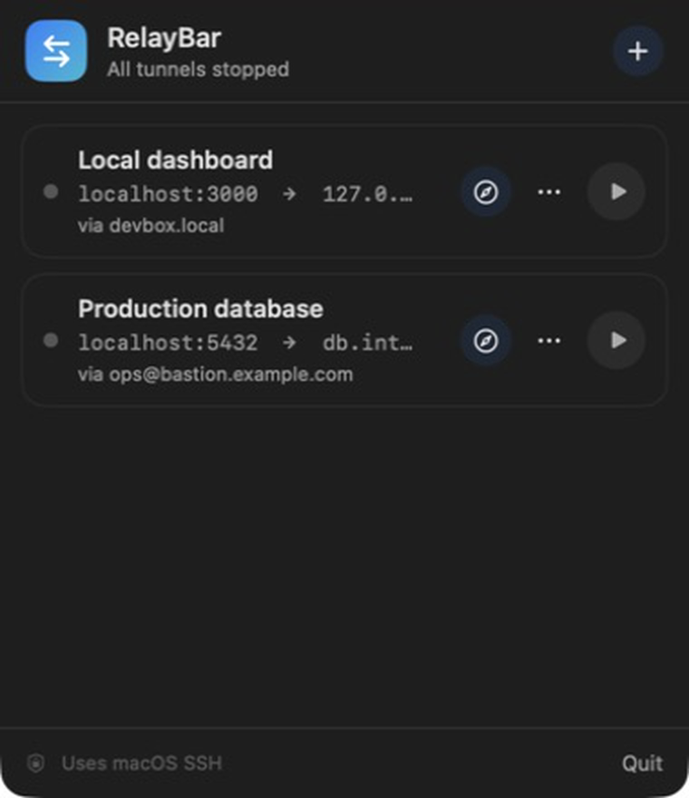
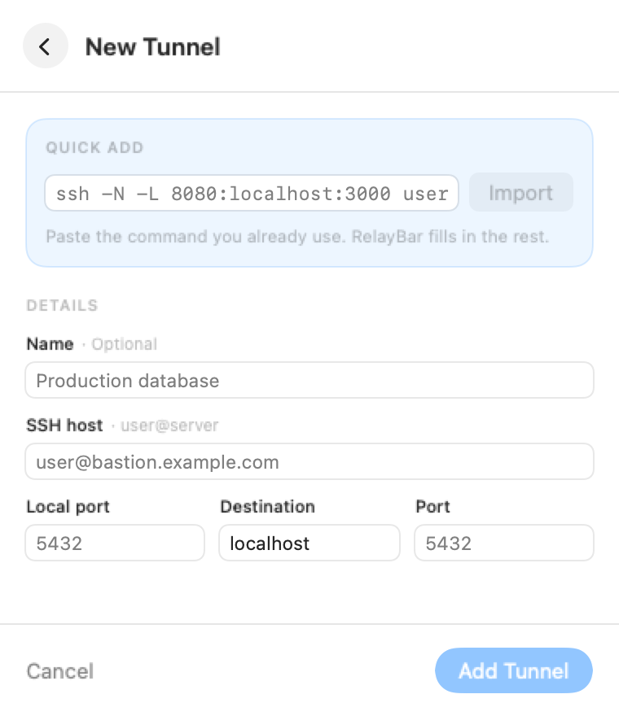

# RelayBar

RelayBar is a tiny native macOS menu-bar app for local SSH port forwards. It has no external dependencies and runs macOS's built-in `/usr/bin/ssh` directly.

[Download the latest release](https://github.com/lx2026/RelayBar/releases/latest)

## Screenshots

<p align="center">
  
  
</p>

## What it does

- Imports common commands such as `ssh -N -L 8080:localhost:3000 user@host`
- Adds tunnels manually with five small fields
- Starts and stops each tunnel with one click
- Starts a tunnel and opens its local URL in the default browser with one click
- Retries unexpected disconnects up to 10 times with exponential backoff
- Shows startup failures directly beside the tunnel
- Stores tunnel definitions in local `UserDefaults`
- Stops child SSH processes when RelayBar quits

RelayBar intentionally manages one local (`-L`) forward per item. Safe connection options such as `-p`, `-J`, `-i`, and a restricted set of `-o` values are preserved when importing a command. Options that can execute local commands, select arbitrary configuration files, or write logs are rejected. RelayBar never invokes a shell.

RelayBar is distributed outside the Mac App Store and is intentionally not sandboxed. Its SSH process behaves like the command-line client: it reads the user's normal `~/.ssh/config` and `known_hosts`, can use configured identity files, and inherits access to the user's SSH agent. SSH still runs non-interactively, so password prompts are not supported. On recent macOS versions, the first connection to a `.local` or LAN host may ask for Local Network access.

## Roadmap

RelayBar only takes on work at the boundary between a remote Claude Code session and the local Mac. It is not becoming a remote search tool, editor, terminal, or general-purpose file manager.

1. **Port forwarding — Complete**
   - Save, start, stop, and retry local SSH forwards.
   - Open the forwarded service in the Mac's default browser.
2. **Remote files — Planned**
   1. **Open a pasted path:** paste an absolute path copied from remote `pwd`, choose a saved server, and open that folder.
   2. **Navigate folders:** show the files and subfolders at that path, with basic navigation and refresh. No search or indexing.
   3. **Download a file:** choose a local destination, track progress, cancel, and reveal the result in Finder.
   4. **Download a folder:** transfer a folder recursively with progress, cancellation, and clear partial-failure handling.
   5. **Preview images:** inspect supported remote images without adding gallery or editing features.
   6. **Render Markdown:** provide a safe, read-only Markdown view as its own delivery milestone. Remote Markdown editing remains Claude Code's job.

## System specs

The concise architecture and behavior archive starts at [`docs/system-specs`](docs/system-specs/README.md).

## Build

Requires macOS 13 or newer and the Xcode command-line tools.

```bash
./scripts/build-app.sh
open .build/RelayBar.app
```

The packaged app is written to `.build/RelayBar.app`. The build script automatically finds the first valid **Developer ID Application** certificate in the login keychain and signs with the hardened runtime.

To create a signed ZIP:

```bash
./scripts/package-release.sh
```

This writes `.build/RelayBar.zip`. A Developer ID signature identifies the publisher, but a downloaded app should also be notarized to pass Gatekeeper without warnings. After storing one `notarytool` keychain profile, notarize and staple with:

```bash
xcrun notarytool store-credentials relaybar-notary \
  --apple-id YOUR_APPLE_ID \
  --team-id YOUR_TEAM_ID \
  --password YOUR_APP_SPECIFIC_PASSWORD

NOTARY_PROFILE=relaybar-notary ./scripts/notarize-release.sh
```

Set `SIGNING_IDENTITY` only when a Mac has multiple Developer ID certificates and the automatic choice is not the one you want.

## Test

```bash
swift test
```
