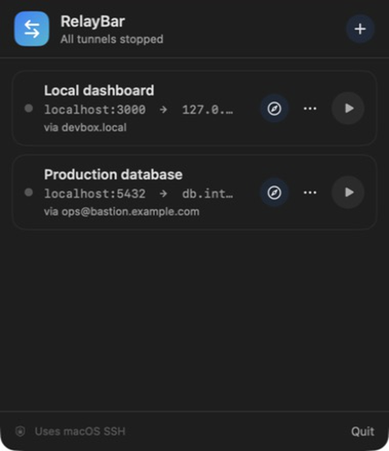
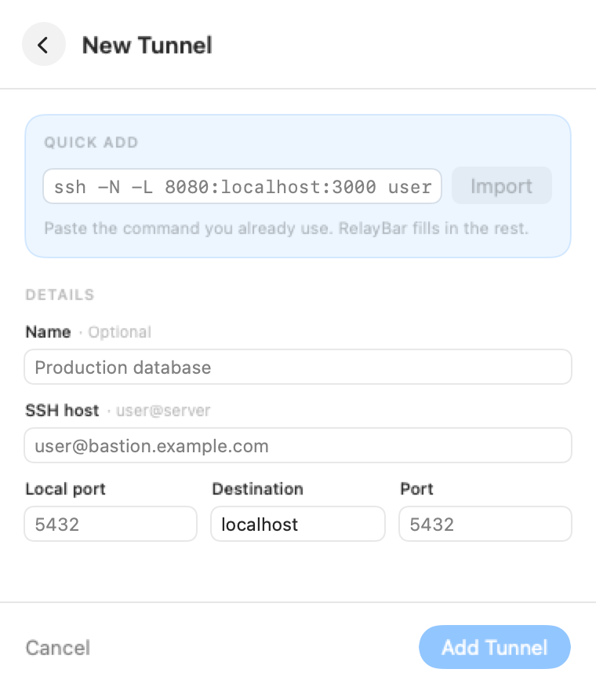

# RelayBar

RelayBar is a tiny native macOS menu-bar app for structured SSH forwarding profiles and exact-path remote file access. It runs macOS's built-in `/usr/bin/ssh` and `/usr/bin/sftp` directly.

[Download v1.2.0](https://github.com/lx2026/RelayBar/releases/download/v1.2.0/RelayBar.zip)
· [Changelog](CHANGELOG.md)

## Screenshots

<p align="center">
  
  
</p>

<p align="center">
  
</p>

## What it does

- Imports repeated and mixed `-L`, `-D`, and `-R` rules from forwarding-only SSH commands
- Supports TCP ports, Unix sockets, local SOCKS, reverse SOCKS, and automatic remote ports
- Runs every rule in a profile over one managed SSH connection
- Optionally groups saved profiles into lightweight menu-bar sections
- Starts and stops each profile with one click
- Opens an unambiguous local TCP forward in the default browser with one click
- Retries unexpected disconnects up to 10 times with exponential backoff
- Shows startup failures directly beside the tunnel
- Stores tunnel definitions in local `UserDefaults`
- Stops child SSH processes when RelayBar quits
- Opens an exact remote folder from a pasted absolute path and saved server
- Downloads remote files or folders with progress, cancellation, and Finder reveal
- Previews supported remote images without adding editing or gallery features
- Renders remote Markdown in a safe, read-only view with GFM, callouts, inert tags, syntax highlighting, footnotes, and native math

For example, Quick Add accepts `ssh -N -D 9999 -p 1234 user@server`, and one profile can combine local, SOCKS, and remote rules. A SOCKS client that should resolve names from the SSH server side must send hostnames through SOCKS, for example:

```bash
curl --socks5-hostname 127.0.0.1:9999 https://example.com
```

RelayBar provides TCP forwarding; it is not a UDP or DNS server and does not change macOS proxy or resolver settings. Reverse SOCKS has the opposite egress direction: clients on the SSH-server side request TCP connections from the Mac's network position. Remote non-loopback listeners also depend on the server's `GatewayPorts` policy.

Safe connection options such as `-p`, `-J`, `-i`, and a restricted set of `-o` values are preserved when importing a command. Forwarding declarations are parsed into typed rules. Options that can execute local commands, select arbitrary configuration files, or write logs are rejected. RelayBar never invokes a shell.

RelayBar is distributed outside the Mac App Store and is intentionally not sandboxed. Its SSH process behaves like the command-line client: it reads the user's normal `~/.ssh/config` and `known_hosts`, can use configured identity files, and inherits access to the user's SSH agent. SSH still runs non-interactively, so password prompts are not supported. On recent macOS versions, the first connection to a `.local` or LAN host may ask for Local Network access.

## Roadmap

RelayBar handles the few steps between a remote server and your Mac. Use Claude Code, Codex, or a terminal to search and edit on the remote machine.

1. **Port forwarding** (complete)
   - ~~Import a standard `ssh -N -L` command.~~
   - ~~Add, edit, and delete a forward by hand.~~
   - ~~Save forward definitions locally.~~
   - ~~Start and stop each forward from the menu bar.~~
   - ~~Start a stopped forward and open its URL in the default browser.~~
   - ~~Retry an unexpected disconnect up to 10 times.~~
   - ~~Show connection errors beside the affected forward.~~
   - ~~Stop managed SSH processes when RelayBar quits.~~
   - ~~Combine repeated local, SOCKS, remote, and Unix-socket rules in one profile.~~
   - ~~Show OpenSSH-assigned remote ports and type-correct endpoint actions.~~
   - ~~Group saved profiles without changing their SSH process state.~~
2. **Remote files** (complete)
   1. ~~**Open a pasted path:** paste an absolute path copied from remote `pwd`, choose a saved server, and open that folder.~~
   2. ~~**Navigate folders:** show the files and subfolders at that path, with basic navigation and refresh. No search or indexing.~~
   3. ~~**Download a file:** choose a local destination, track progress, cancel, and reveal the result in Finder.~~
   4. ~~**Download a folder:** transfer a folder recursively, show progress, and allow cancellation.~~
   5. ~~**Preview images:** preview one supported remote image at a time.~~
   6. ~~**Render Markdown:** render GFM and common Obsidian reading syntax in a bounded, read-only native view. Remote images and embeds are not fetched, raw HTML is inert, and Mermaid remains source-only.~~

Remote file operations stop at opening, previewing, and downloading.

Markdown rendering uses exactly pinned open-source packages. Required license text is bundled from [`THIRD_PARTY_NOTICES.txt`](Sources/RelayBar/Resources/THIRD_PARTY_NOTICES.txt).

## System specs

The concise architecture and behavior archive starts at [`docs/system-specs`](docs/system-specs/README.md).

## Build

Requires macOS 13 or newer and the Xcode command-line tools.

```bash
./scripts/build-app.sh
open .build/RelayBar.app
```

The packaged app is written to `.build/RelayBar.app`. The build script automatically finds the first valid **Developer ID Application** certificate in the login keychain and signs with the hardened runtime.

To create a signed ZIP:

```bash
./scripts/package-release.sh
```

This writes `.build/RelayBar.zip`. A Developer ID signature identifies the publisher, but a downloaded app should also be notarized to pass Gatekeeper without warnings. After storing one `notarytool` keychain profile, notarize and staple with:

```bash
xcrun notarytool store-credentials YOUR_NOTARY_PROFILE \
  --apple-id YOUR_APPLE_ID \
  --team-id YOUR_TEAM_ID \
  --password YOUR_APP_SPECIFIC_PASSWORD

NOTARY_PROFILE=YOUR_NOTARY_PROFILE ./scripts/notarize-release.sh
```

Set `SIGNING_IDENTITY` only when a Mac has multiple Developer ID certificates and the automatic choice is not the one you want.

## Test

```bash
swift test
```
